Vg1 IM student. I build websites from scratch using vanilla HTML, CSS and JavaScript.
The goal is to become a developer and build real projects.

**Right now:** my portfolio at [victorguminski.com](https://victorguminski.com), written by hand,
tested in a real browser on every push, and deployed with Cloudflare Pages.

## What I work with

## Experience

**Companion AI & Nordic AI** · March 2026 to August 2026
Tester and IT employee, mostly on [com2.ai](https://com2.ai/), which is built
with React, TypeScript and Vite on the front and NestJS on Node.js behind it.
That is the stack I worked in every day. Some of the time went to
[nordicai.net](https://www.nordicai.net/).

## Projects

| Project | What it is |
| --- | --- |
| [victorguminski.com](https://github.com/victorguminski18/victorguminski18.github.io) | My portfolio. Vanilla HTML, CSS and JS with light and dark mode, animations, security headers and 33 browser tests in CI. |
| [html-css-course](https://github.com/victorguminski18/html-css-course) | HTML and CSS practice projects and exercises from a frontend development course, including a clone of the YouTube start page. |
| [javascript-course](https://github.com/victorguminski18/javascript-course) | My journey learning JavaScript: variables, booleans, functions, a cart quantity exercise and rock paper scissors. |

## Stats

<picture>
  <source media="(prefers-color-scheme: dark)"
    srcset="https://github-readme-stats.vercel.app/api?username=victorguminski18&show_icons=true&theme=transparent&title_color=38bdf8&icon_color=818cf8&text_color=94a3b8&hide_border=true">
  
</picture>
<picture>
  <source media="(prefers-color-scheme: dark)"
    srcset="https://github-readme-stats.vercel.app/api/top-langs/?username=victorguminski18&layout=donut&theme=transparent&title_color=38bdf8&text_color=94a3b8&hide_border=true">
  
</picture>
